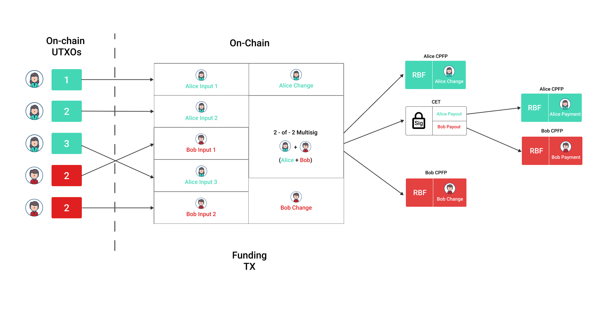

# Non-Interactive Onchain Protocol

# Table of Contents

* [Abstract](#abstract)
* [General Requirements](#general-requirements)
* [Fee-Bumping Policy](#fee-bumping-policy)
* [Funding Phase](#funding-phase)
* [Execution Phase](#execution-phase)
* [Reorgs](#reorgs)

## Abstract

DLCs allow two parties to conduct stateful bitcoin contracts by giving each
other a *counter-signed set of CETs*.
These CETs all spend the same output from a funding transaction and thus only one
CET can be confirmed.
A single CET is finalized when an outcome is signed by a previously chosen set of oracles.

The contract is established once funding transaction signatures have been exchanged.
From that point on each party should assume their counter-party is non-cooperative and should ensure either
confirmation of the funding transaction or else double-spend its collateral inputs to avoid exploitation.

Once funding transaction signatures are exchanged, DLC parties aren't required to interact anymore.
There are three scenarios to consider:

1. The funding transaction doesn't confirm, and so a party must either bump its fee-rate to confirm
    before the earliest DLC maturation or else double-spend its funding collateral canceling the DLC.
  * Child Pays For Parent (CPFP) with BIP 125 Replace by Fee (RBF) enabled is used for fee bumping.
2. The funding transaction confirms, and the oracle releases the outcome signature, so a
   participant must broadcast the CET corresponding to the oracle outcome.
3. The funding transaction confirms, and the oracle doesn't release an outcome signature
    before the `refund_locktime`, so a party must broadcast the refund transaction.

# General Requirements

A DLC client should have censorship-resistant access to the blockchain, use a
local fee-estimator and ensure it is well-connected to the tx-relay network.

We recommend that clients should register no callbacks on mempool events as doing so may be a source of
cross-layer mapping. [Cross-layer Mapping](https://arxiv.org/pdf/2007.00764.pdf)

We recommend that clients should not produce local (non-adaptor) signatures for CETs until they are about
to be broadcast in order to avoid their misuse in case of site compromise, assuming an external signer.

Furthermore, we recommend duplicated backups of counter-party signatures be stored to avoid relying on
honest counter-party behavior in the case of primary storage failure.

Transaction finalization does not imply a mandatory key material access. [ FIXME: Client Key Management. ]

# Fee bumping policy

A state machine following on-chain events must take actions based on different clocks parameterized by three
values: `congestion_bump_frequency`/`security_bump_frequency`/`funding_security_point`/`refund_security_point`.
These values' definitions and setting recommendations are laid out in this section and their usage is made
more precise in following sections.

A `security_point` is a client-side heuristic time/block-stamp after which the confirmation of a corresponding
transaction is a matter of contract safety.
If confirmation does not occur soon after this point, the user can be vulnerable to a malicious double-spend if either
the outcome odds change or an oracle signature is released.
The `funding_security_point` is determined as a function of the earliest possible event signing time, which may be static or dynamic.
The `refund_security_point` is determined as a function of the user's trust towards the oracle.
We defer the exact determination of `security_point`s to the client.

If the `security_point` time is static (block height, epoch) or predictable, we recommend setting 
`security_point`s to have a confirmation buffer of 20 blocks from that time.

A client's `congestion_bump_frequency`/`security_bump_frequency` can be scheduled on at least three
different kinds of events:

- a block height
- a local clock
- an observed fee-rate fluctuation

Note that these criteria may be observable by an adversary and we recommend for implementations
to pad any criteria with a random delay to diminish the risks of tx-relay jamming.

We don't provide recommendations for the `congestion_bump_frequency` as its settings depends on user
liquidity preferences and the availability of local data to predict the fee-rate.
Confirmation of non-time-sensitive transactions should happen eventually, but a user may prefer to delay
confirmation in the case of mempool-congestion.

We recommend a `security_bump_frequency` of 1 block, preferably with a fast-confirmation fee-rate as reported
by a fee-estimator if possible.
This recommendation is made because any transaction under this fee-bumping policy has a time-sensitive confirmation.

Having different fee-bumping frequencies for congestion and security avoids a client overpaying in
fees in the case of mempool spikes, while anticipating that at some point during DLC execution, the
confirmation of certain transactions is a security concern.

# Funding Phase

A DLC participant always begins the protocol in the funding phase.
The funding phase can terminate either to the execution phase by a transition to the execution phase or to an abort.

## Requirements

A node:

  - if all counter-party CET and funding signatures are received:
    - MUST finalize the funding transaction with a local `SIGHASH_ALL` signatures
    - MUST broadcast the funding transaction
    - MUST start a fee-bumping timer of length `congestion_bump_frequency`

A node:

  - if a funding signature has been sent or a funding transaction broadcast and there is no confirmation:
    - if `congestion_bump_frequency` expires:
      - MUST spend the change output with a CPFP increasing package fee-rate to shorten confirmation time
      - MUST replace the CPFP transaction according to BIP 125
      - MUST reschedule timer for next bump
    - if `funding_security_point` is reached:
      - MUST spend a funding input with a higher-fee-rate transaction/absolute fee than any previously propagated package fee-rate
      - MUST start a fee-bumping timer of length `security_bump_frequency`
      - MUST disable `congestion_bump_frequency` timer
    - if `security_bump_frequency` expires:
      - MUST spend a funding input with a higher-fee-rate transaction/absolute fee than any previously propagated package fee-rate
      - MUST replace the CPFP transaction according to BIP 125
      - MUST reschedule timer for next bump
    - MUST NOT spend more in bumping fees than its collateral input value
    - if outcome odds are unfavorable:
      - MAY disable funding fee-bumping

A node:

  - if the funding transaction confirms:
    - MUST track spend of the funding output
    - MUST advance its off-chain state to the execution phase
    - MUST note its change output for later spend

A node:

  - if a counter-party funding input double-spend confirms:
    - MUST abort the DLC and prevent further interactions with that counter-party

## Rationale

The funding transaction must be confirmed to consider the off-chain state initialized.
As mempool congestion may fluctuate between fee negotiation and transaction propagation, parties
must unilaterally adjust the package fee-rate (using CPFP) according to their confirmation preferences.
A party may choose to wait for mempools to drain before adjusting the fee-rate to avoid over-paying in
fees seeing as the block height of a transition to the execution phase doesn't matter, so long as it's
before the earliest possible (expected) contract execution.

As the earliest possible (expected) contract execution approaches, the funding transaction must
be confirmed quickly as a matter of security.
After the oracle releases a signature, a malicious party could try to double-spend an unconfirmed funding
transaction to avoid losing their collateral without the use of deceitful cooperation with the oracle.

In the case that a counter-party double-spends a funding input, cleaning off-chain state prevents
further exploitation at this level.
For example, a DLC implementation that has received _correct_ signatures but where the contract is
invalid could still be displaying incorrect information to the user.
A double-spending counter-party is "breaking" the previously negotiated DLC that has been agreed to
by its signature exchange.
Thus further interactions should be avoided with this buggy/malicious peer.

# Execution Phase

The execution phase transitions to the terminal phase by confirming either a CET or a refund transaction.

## Requirements

A node:

  - if an oracle signature is received:
    - MUST finalize the CET with a local `SIGHASH_ALL` signature
    - MUST broadcast the CET
    - MAY spend its outcome output with a CPFP increasing package fee-rate to shorten confirmation time
    - if the CET is not confirmed and `refund_locktime` is 20 blocks ahead of local tip:
      - MUST spend its outcome output with a CPFP increasing package fee-rate to shorten confirmation time
      - MUST rebroadcast the CET
      - MUST start a fee-bumping timer of length `security_bump_frequency`
    - if `security_bump_frequency` expires:
      - MUST spend the change output with a replacing CPFP increasing package fee-rate to shorten confirmation time
      - MUST replace the CPFP transaction according to BIP 125
      - MUST reschedule timer for next bump
    - MUST NOT spend more in bumping fees than its outcome value
    - MAY NOT spend more in bumping fees than its outcome value - refund value if the oracle is trusted
    - if the outcome realization is unfavorable:
      - MAY disable CET fee-bumping

A node:

  - if a CET confirms:
    - MUST note its outcome output for later spend
    - MUST advance its off-chain state to the terminal phase

A node:

  - if no oracle signature has been received and `refund_locktime` is reached:
    - MUST finalize the refund transaction with a local `SIGHASH_ALL` signature
    - MUST broadcast the refund transaction
    - if the refund is not confirmed after `congestion_bump_frequency`:
      - MUST spend the change output with a CPFP increasing package fee-rate to shorten confirmation time
      - MUST start a fee-bumping timer of length `refund_congestion_bump_frequency`
    - if `refund_congestion_bump_frequency` expires:
      - MUST spend the change output with a replacing CPFP increasing package fee-rate to shorten confirmation time
      - MUST replace the CPFP transaction according to BIP 125
      - MUST reschedule timer for next bump
    - if `refund_security_point` is reached:
      - MUST spend a funding input with a higher-fee-rate transaction/absolute fee than any previously propagated package fee-rate
      - MUST start a fee-bumping timer of length `security_bump_frequency`
      - MUST disable `refund_congestion_bump_frequency` timer
    - if `security_bump_frequency` expires:
      - MUST spend a funding input with a higher-fee-rate transaction/absolute fee than any previously propagated package fee-rate
      - MUST replace the CPFP transaction according to BIP 125
      - MUST reschedule timer for next bump

A node:

  - if a refund transaction confirms:
    - MUST note its outcome output for later spend
    - MUST advances its off-chain state to the terminal phase

## Rationale

As `refund_locktime` approaches, a CET must be confirmed quickly as a matter of security.
A malicious party could try to cancel an unfavorable DLC by confirming the refund transaction.

A refund transaction confirmation is less sensitive but it should be noted that while participants are 
waiting for refund confirmations, the oracle key material is toxic.
In case of oracle key compromise, a CET could be signed and confirmed by a malicious counter-party.
Refund transaction confirmation should be managed as a function of the user's trust towards the oracle.

# Reorgs

Reorgs must be handled by clients as they are a source of funds loss in case of mishandling.

## Requirements

A node:

  - if a funding transaction is disconnected
    - MUST roll back its state to funding phase starting
    - if a CET or refund transaction is disconnected
      - MUST roll back its state to execution phase starting

# Authors

Antoine Riard <antoine.riard@gmail.com>

 
This work is licensed under a [Creative Commons Attribution 4.0 International License](http://creativecommons.org/licenses/by/4.0/).
