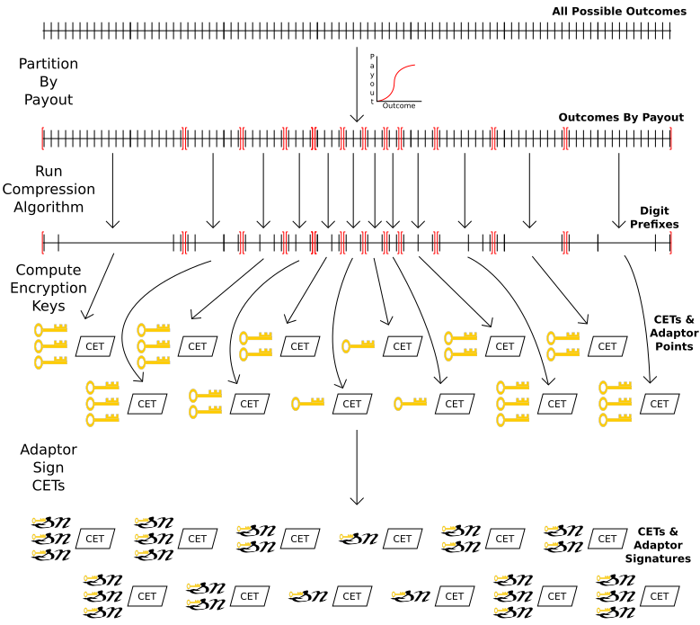

# Numeric Outcome DLCs

## Introduction

This document combines the [Numeric Outcome Compression](NumericOutcomeCompression.md) and [Payout Curve](PayoutCurve.md) specifications, along with
independently introduced [Rounding Intervals](#rounding-intervals) to specify the complete procedure for CET
construction, adaptor signing, and signature verification for DLCs over numeric outcomes.

When dealing with enumerated outcomes, DLCs require only a single nonce and Contract Execution
Transactions (CETs) are claimed using a single oracle attestation.
This scheme results in DLCs which contain a unique adaptor signature for every possible outcome, which
is only feasible if the number of possible outcomes is of manageable size. 

If an outcome can be any of a large range of numbers, then using a simple enumeration of
all possible numbers in this range is unwieldy.
We optimize for this case by using numeric decomposition in which the oracle signs each digit of the outcome
individually so that many possible outcomes can be [compressed](NumericOutcomeCompression.md) into a single adaptor signature by ignoring certain digits.

We also compress the information needed to communicate all outcomes, as this can usually be viewed as a
[payout curve](PayoutCurve.md) parameterized by only a few numbers which determine payouts for the entire possible domain.

Lastly, we introduce a method of deterministic rounding which allows DLC participants to increase Numeric
outcome compression in places where they are willing to allow some additional rounding error in their payouts.

We put all of these pieces together to specify CET calculation, adaptor signing, and signature validation procedures
for Numeric Outcome DLCs.

This specification, as well as the [payout curve](PayoutCurve.md) and [Numeric Outcome compression](NumericOutcomeCompression.md) specifications are primarily concerned
with the protocol-level deterministic reproduction and concise communication of generic higher-level information.
These documents are not likely to concern application-level and UI/UX developers, who should operate at
their own levels of abstraction, only to compile application-level information into the formats specified here
when interacting with lowest-level core DLC logic.

## Table of Contents

* [Rounding Intervals](#rounding-intervals)
  * [Reference Implementations](#reference-implementations)
  * [Rounding Interval Serialization](#rounding-interval-serialization)

* [Contract Execution Transaction Calculation and Signing](#contract-execution-transaction-calculation-and-signing)
* [Contract Execution Transaction Signature Validation](#contract-execution-transaction-signature-validation)
* [Authors](#authors)

## Rounding Intervals

As detailed in the [numeric outcome compression document](NumericOutcomeCompression.md#numeric-outcome-compression), any time some continuous interval of the domain results in a constant
payout value, we can compress the adaptor signatures required for that interval to be logarithmic in size compared to using one adaptor
signature per outcome on the interval.
As such, it can be beneficial to round the outputs of the payout function to allow for bounded approximation of pieces of the payout
curve by constant-payout intervals.
For example, if two parties are both willing to round payout values to the nearest 100 satoshis, they can have significant savings
on the number of adaptor signatures required to enforce their contract.
To this end, we allow parties to negotiate rounding intervals which may vary along the curve, allowing for less rounding near more
probable outcomes and allowing for more rounding to occur near extremes.

Each party has their own minimum `rounding_intervals` and the rounding to be used at a given `event_outcome` is the minimum
of both party's rounding moduli.

If `R` is the rounding modulus to be used for a given `event_outcome` and the result of function evaluation for that `event_outcome` is `value`,
then the amount to be used in the CET output for this party will be the closer of `value - (value % R)` or `value - (value % R) + R`, rounding
up in the case of a tie.

#### Reference Implementations

* [bitcoin-s](https://github.com/bitcoin-s/bitcoin-s/blob/58070f41209bb97f3648deb11eff829d70c50cca/core/src/main/scala/org/bitcoins/core/protocol/dlc/models/RoundingIntervals.scala#L14)

#### Rounding Interval Serialization

1. data:
   * [`bigsize`:`num_rounding_intervals`]
   * [`u64`:`begin_interval_1`]
   * [`u64`:`rounding_mod_1`]
   * ...
   * [`u64`:`begin_interval_num_rounding_intervals`]
   * [`u64`:`rounding_mod_num_rounding_intervals`]

`num_rounding_intervals` is the number of rounding intervals specified in this function and can be
zero in which case a rounding modulus of `1` is used everywhere.
Each serialized rounding interval consists of two `u64` integers.

The first integer is called `begin_interval` and refers to the x-coordinate (`event_outcome`) at which this range begins.
The second integer is called `rounding_mod` and contains the rounding modulus to be used in this range.

If `begin_interval_1` is strictly greater than `0`, then the interval between `0` and `begin_interval_1` has a precision of `1`.

#### Requirements

* `begin_interval_1`, if it exists, MUST be non-negative.
* `begin_interval` MUST strictly increase.

## Contract Execution Transaction Calculation and Signing

Given the offerrer's [payout function](PayoutCurve.md), a `total_collateral` amount and [rounding intervals](#rounding-intervals), we wish to compute a list of pairs
of digit prefixes (i.e. arrays of integers) and Satoshi values.
Each of these pairs will then be turned into a CET whose adaptor point used for signing is [computed from the digit prefix](NumericOutcomeCompression.md#adaptor-points-with-multiple-signatures) and
whose output values will be equal to the Satoshi payout and `total_collateral` minus that payout.

We must first modify the pure function given to us (e.g. by interpolating points) by applying rounding, and then setting all
negative payouts to `0` and all computed payouts above `total_collateral` to equal `total_collateral`.

Next, we split the function's domain into two kinds of intervals:

1. Intervals in which the modified function's value is constant.
2. Intervals in which the modified function's values are changing at every point.

This can be done by evaluating the modified function at every point in the domain and keeping track of whether or not the value has
changed to construct the intervals, but this is not a particularly efficient solution.
There are countless ways to go about making this process more efficient such as binary searching for function value changes or looking
at the unmodified function's derivatives.

Regardless of how these intervals are computed, it is required that the constant-valued intervals be as large as possible.
For example, if you have two constant-valued intervals in a row with the same value, these must be merged.

Finally, once these intervals have been computed, the [numeric outcome compression](NumericOutcomeCompression.md#numeric-outcome-compression) algorithm is run on each constant-valued interval
which generates a digit prefix (list of integers) to be paired with the (constant) payout for that interval.
Only a single CET is required for each interval (as these intervals have constant payouts) where each of them receives multiple adaptor signatures.

For variable-payout intervals, a unique CET and adaptor signature is constructed for every `event_outcome` where all digits of that `event_outcome`
are included in the digit prefix (array of integers) and the Satoshi payout is equal to the output of the modified function for that `event_outcome`.

The following diagram illustrates the entire process starting with the domain of all possible outcomes and the modified payout curve, then
partitioning by payout into intervals of constant value (in red), running numeric outcome compression to get digit prefixes, turning these prefixes
into adaptor points for their interval's CET and finally using those adaptor points to create adaptor signatures on their corresponding CETs.

## Contract Execution Transaction Signature Validation

To validate the adaptor signatures for CETs given in a `dlc_accept` or `dlc_sign` message, do the [process above](#contract-execution-transaction-calculation-and-signing) of computing the list of pairs of
arrays of digits and payout values to construct the CETs and their adaptor points and then run the `adaptor_verify` function.

However, if `adaptor_verify` results in a failed validation, do not terminate the CET signature validation process.
Instead, you must look at whether you rounded up (to `value - (value % rounding_mod) + rounding_mod`)
or down (to `value - (value % rounding_mod)`).
If you rounded up, compute the CET and adaptor point resulting from rounding down or if you rounded down, compute the CET and adaptor point
 resulting from rounding up.
Call the `adaptor_verify` function against this new CET with the new adaptor point and if it passes verification, consider that adaptor signature
valid and continue.

This extra step is necessary because there is no way to introduce deterministic floating point computations into this specification without also
introducing complexity of magnitude much larger than that of this entire specification.
This is because there are no guarantees provided by hardware, operating systems, or programming language compilers that doing the same
floating point computation twice will yield the same results.
Thus, this specification instead takes the stance that clients must be resilient to off-by-precision (off-by-one * rounding_mod) differences between machines.

## Authors

Nadav Kohen <nadavk25@gmail.com>

 
This work is licensed under a [Creative Commons Attribution 4.0 International License](http://creativecommons.org/licenses/by/4.0/).

