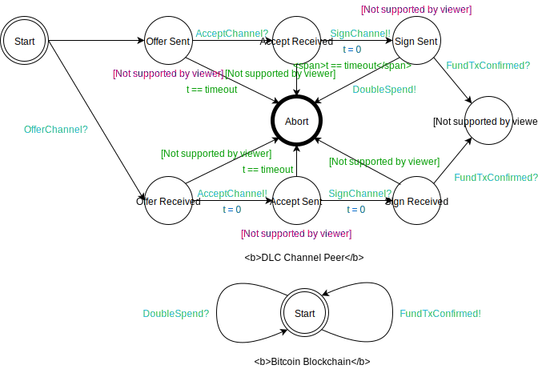

# Peer Protocol for Contract Negotiation

# Table of Contents

* [Contract](#contract)
    * [Definition of `contract_id`](#definition-of-contract_id)
    * [Contract Negotiation](#contract-negotiation)
        * [The `offer_dlc` Message](#the-offer_dlc-message)
            * [Requirements](#requirements)
        * [The `accept_dlc` Message](#the-accept_dlc-message)
            * [Requirements](#requirements-1)
        * [The `sign_dlc` Message](#the-sign_dlc-message)
            * [Requirements](#requirements-2)
        * [Script Pubkey Standardness Definition](#script-pubkey-standardness-definition)
* [Channel](#channel)
    * [Overview](#overview)
        * [State machine representation](#state-machine-representation)
    * [The `offer_channel` message](#the-offer_channel-message)
    * [The `accept_channel` message](#the-accept_channel-message)
    * [The `sign_channel` message](#the-sign_channel-message)
    * [The `settle_offer` message](#the-settle_offer-message)
    * [The `settle_accept` message](#the-settle_accept-message)
    * [The `settle_confirm` message](#the-settle_confirm-message)
    * [The `settle_finalize` message](#the-settle_finalize-message)
    * [The `renew_offer` message](#the-renew_offer-message)
    * [The `renew_accept` message](#the-renew_accept-message)
    * [The `renew_confirm` message](#the-renew_confirm-message)
    * [The `renew_finalize` message](#the-renew_finalize-message)
* [Authors](#authors)

# Contract

## Definition of `contract_id`

Prior to a contract being accepted, a `temporary_contract_id` is used,
which is the SHA256 hash of the offer message.

Most messages use a `contract_id` to identify the contract. It's
derived from the funding transaction and the offer by combining the `funding_txid`,
the `funding_output_index` and the `temporary_contract_id`, using big-endian
exclusive-OR (i.e. `funding_output_index` alters the last 2 bytes of
`funding_txid XOR temporary_contract_id`).

## Contract Negotiation

Contract Negotiation consists of the initiator (aka offerer) sending an `offer_dlc` message,
followed by the responding node (aka accepter) sending `accept_dlc`. With the
contract parameters locked in, both parties are able to create the funding
transaction and subsequently all contract execution transactions (CETs) and the refund transaction, as described in the [transaction specification](Transactions.md). As such, the accepter includes its signatures of the CETs and refund transaction in the `accept_dlc` message.
The initiator is now able to generate signatures for all CETs and the refund transaction, as well as the funding transaction, and send them over using the `sign_dlc` message.

Once the accepter receives the `sign_dlc` message, it
must broadcast the funding transaction to the Bitcoin network.

    +-------+                    +-------+
    |       |                    |       |
    |       |---- (1) offer  --->|       |
    |       |                    |       |
    |       |<--- (2) accept ----|       |
    |   A   |                    |   B   |
    |       |---- (3) sign   --->|       |
    |       |                    |       |
    |       |                    |  (4) broadcast fund-tx
    |       |                    |       |
    +-------+                    +-------+
    
        - where node A is 'offerer' and node B is 'accepter'

If this fails at any stage, or if one node decides the contract terms
offered by the other node are not suitable, the contract negotiation
fails.

Note that multiple contracts can be open in parallel, as all DLC
messages are identified by either a `temporary_contract_id` (before the
funding transaction is created) or a `contract_id` (derived from the
funding transaction).

### The `offer_dlc` Message

This message contains information about a node and indicates its
desire to enter into a new contract. This is the first step toward creating
the funding transaction and CETs.

1. type: 42778 (`offer_dlc_v0`)
2. data:
   * [`u32`: `protocol_version`]
   * [`byte`:`contract_flags`]
   * [`chain_hash`:`chain_hash`]
   * [`32*byte`:`temporary_contract_id`]
   * [`contract_info`:`contract_info`]
   * [`point`:`funding_pubkey`]
   * [`spk`:`payout_spk`]
   * [`u64`:`payout_serial_id`]
   * [`u64`:`offer_collateral_satoshis`]
   * [`bigsize`:`num_funding_inputs`]
   * [`num_funding_inputs*funding_input`:`funding_inputs`]
   * [`spk`:`change_spk`]
   * [`u64`:`change_serial_id`]
   * [`u64`:`fund_output_serial_id`]
   * [`u64`:`feerate_per_vb`]
   * [`u32`:`cet_locktime`]
   * [`u32`:`refund_locktime`]
   * [`offer_tlvs`: `tlvs`]

[//]: # (TODO: `protocol_version` should be advertised by DLC nodes in the future)
The `protocol_version` value denotes the version of the protocol that the offering node is proposing.
If the receiving node does not support the requested version, it should ignore the message.
The current protocol version is `1`.

No bits of `contract_flags` are currently defined, this field should be ignored.

The `chain_hash` value denotes the exact blockchain that the DLC will
reside within. This is usually the genesis hash of the respective blockchain.
The existence of the `chain_hash` allows nodes to open contracts
across many distinct blockchains as well as have contracts within multiple
blockchains opened to the same peer (if it supports the target chains).

The `temporary_contract_id` is used to identify the contract on a per-peer basis until the funding transaction is established, at which point it is replaced by the contract_id, which is derived from the funding transaction.

`contract_info` specifies the contract to be constructed and the oracles to be used.

`funding_pubkey` is the public key in the 2-of-2 multisig script of
the funding transaction output. `payout_spk` specifies the script
pubkey that CETs and the refund transaction should use in the sender's output.

`offer_collateral_satoshis` is the amount the sender is putting into the
contract. `num_funding_inputs` is the number of funding inputs contributed by
the sender and `funding_inputs` contains outputs, outpoints, and expected weights
of the sender's funding inputs. `change_spk` specifies the script pubkey that funding
change should be sent to.

`payout_serial_id` is a randomly chosen number which uniquely identifies the payout output of the offering party.
Outputs in the contract execution transaction will be sorted by `payout_serial_id`.

`change_serial_id` is a randomly chosen number which uniquely identifies the change output.
Outputs in the funding transaction will be sorted by `change_serial_id` and `fund_output_serial_id`.

`fund_output_serial_id` is a randomly chosen number which uniquely identifies the funding output.
Outputs in the funding transaction will be sorted by `change_serial_id` and `fund_output_serial_id`.

`feerate_per_vb` indicates the fee rate in satoshi per virtual byte that both
sides will use to compute fees in the funding transaction, as described in the
[transaction specification](Transactions.md).

`cet_locktime` is the nLockTime to be put on CETs. `refund_locktime` is the nLockTime to be put on the refund transaction.

#### Requirements

The sending node MUST:

  - set undefined bits in `contract_flags` to 0.
  - ensure the `chain_hash` value identifies the chain it wishes to open the contract within.
  - set `temporary_contract_id` to a random value.
  - set `payout_spk` and `change_spk` to a [standard script pubkey](#script-pubkey-standardness-definition).
  - set `funding_pubkey` to a valid secp256k1 pubkey in compressed format.
  - set `offer_collateral_satoshis` to a value greater than or equal to 1000.
  - set `cet_locktime` and `refund_locktime` to either both be UNIX timestamps, or both be block heights as distinguished [here](https://en.bitcoin.it/wiki/NLockTime).
  - set `cet_locktime` to be less than `refund_locktime`.
  - use a unique `input_serial_id` for each input
  - set `change_serial_id` and `fund_output_serial_id` to different values
  - use valid [contract descriptor(s)](./Messaging.md#The-contract_descriptor-Type) within `contract_info`.

The sending node SHOULD:

  - set `feerate_per_vb` to at least the rate it estimates would cause the transaction to be immediately included in a block.
  - set `cet_locktime` to no later than the earliest expected oracle signature time.
  - set `refund_locktime` sufficiently long after the latest possible release of oracle signatures added to all other delays to closing the contract.
  - set `payout_spk` to a previously unused script public key.
  - set `change_spk` to a previously unused script public key.

The receiving node MUST:

  - ensure that the `temporary_contract_id` is unique from any other contract ID with the same peer.
  - ignore undefined bits in `contract_flags`.

The receiving node MAY reject the contract if:

  - it does not agree to the terms in `contract_info`.
  - the `contract_info` is missing relevant events.
  - it does not want to use the oracle(s) specified in `contract_info`.
  - `offer_collateral_satoshis` is too small.
  - `feerate_per_vb` is too small.
  - `feerate_per_vb` is too large.

The receiving node MUST reject the contract if:

  - the `chain_hash` value is set to a hash of a chain that is unknown to the receiver.
  - the `temporary_contract_id` is not unique from any other contract ID with the same peer.
  - the `contract_info` refers to events unknown to the receiver.
  - the `contract_info` refers to an oracle unknown or inaccessible to the receiver.
  - `payout_spk` or `change_spk` are not a [standard script pubkey](#script-pubkey-standardness-definition).
  - it considers `feerate_per_vb` too small for timely processing or unreasonably large.
  - `funding_pubkey` is not a valid secp256k1 pubkey in compressed format.
  - `funding_inputs` do not contribute at least `total_collateral_satoshis` plus full [fee payment](Transactions.md#fee-payment).
  - Any `input_serial_id` is duplicated
  - The `fund_output_serial_id` and `change_serial_id` are not set to different value
  - Any input in `funding_inputs` is not a BIP141 (Segregated Witness) input.
  - invalid [contract descriptor(s)](./Messaging.md#The-contract_descriptor-Type) are used within `contract_info`.

### The `accept_dlc` Message

This message contains information about a node and indicates its
acceptance of the new DLC, as well as its CET and refund transaction
signatures. This is the second step toward creating the funding transaction
and closing transactions.

1. type: 42780 (`accept_dlc_v0`)
2. data:
   * [`u32`: `protocol_version`]
   * [`32*byte`:`temporary_contract_id`]
   * [`u64`:`accept_collateral_satoshis`]
   * [`point`:`funding_pubkey`]
   * [`spk`:`payout_spk`]
   * [`u64`:`payout_serial_id`]
   * [`bigsize`:`num_funding_inputs`]
   * [`num_funding_inputs*funding_input`:`funding_inputs`]
   * [`spk`:`change_spk`]
   * [`u64`:`change_serial_id`]
   * [`cet_adaptor_signatures`:`cet_adaptor_signatures`]
   * [`signature`:`refund_signature`]
   * [`negotiation_fields`:`negotiation_fields`] (Optional: 1)
   * [`accept_tlvs`: `tlvs`]

#### Requirements

The `temporary_contract_id` MUST be the same as the `temporary_contract_id` in the `offer_contract` message.

The sender MUST:

  - set `protocol_version` to the same value as the one in the received `offer_dlc` message.
  - set `accept_collateral_satoshis` to equal the `offer_dlc`'s `contract_info` `total_collateral` minus the `offer_collateral_satoshis`.
  - set `payout_spk` and `change_spk` to a [standard script pubkey](#script-pubkey-standardness-definition)
  - set `cet_adaptor_signatures` to valid adaptor signatures, using its `funding_pubkey` for each CET, as defined in the [transaction specification](Transactions.md#contract-execution-transaction) and using signature public keys computed using the `offer_dlc`'s `contract_info` and `oracle_info` as adaptor points.
  - include an adaptor signature in `cet_adaptor_signatures` for every event specified in the `offer_dlc`'s `contract_info`.
  - set `refund_signature` to the valid signature, using its `funding_pubkey` for the refund transaction, as defined in the [transaction specification](Transactions.md#refund-transaction).
  - use a unique `input_serial_id` for each input
  - use a unique `change_serial_id`
  - set `change_serial_id` so that it is not equal to the `fund_output_serial_id`
  - use a unique `payout_serial_id`

The sender SHOULD:

  - set `payout_spk` to a previously unused script public key.
  - set `change_spk` to a previously unused script public key.

The receiver:

  - if `accept_collateral_satoshis` is not `total_collateral - offer_collateral_satoshis`:
    - MAY reject the contract.
  - if `payout_spk` or `change_spk` are not a [standard script pubkey](#script-pubkey-standardness-definition)
    - MUST reject the contract.
  - if any input in `funding_inputs` is not a BIP141 (Segregated Witness) input.
    - MUST reject the contract.
  - if `cet_adaptor_signatures` or `refund_signature` fail validation:
    - MUST reject the contract.
  - if `funding_inputs` do not contribute at least `accept_collateral_satoshis` plus [fee payment](Transactions.md#fee-payment)
    - MUST reject the contract.
  - if any `input_serial_id` is duplicated
    - MUST reject the contract.
  - if any `change_serial_id` is duplicated
    - MUST reject the contract.
  - if any `change_serial_id` is equal to the `fund_output_serial_id`
    - MUST reject the contract.
  - if any `payout_serial_id` is duplicated
    - MUST reject the contract.

Other fields have the same requirements as their counterparts in `offer_dlc`.

### The `sign_dlc` Message

This message gives all of the initiator's signatures, which allows the receiver
to broadcast the funding transaction with both parties being fully committed to
all closing transactions.

This message introduces the [`contract_id`](#definition-of-contract_id) to identify the contract.

1. type: 42782 (`sign_dlc_v0`)
2. data:
   * [`u32`: `protocol_version`]
   * [`contract_id`:`contract_id`]
   * [`cet_adaptor_signatures`:`cet_adaptor_signatures`]
   * [`signature`:`refund_signature`]
   * [`funding_signatures`:`funding_signatures`]
   * [`sign_tlvs`: `tlvs`]

#### Requirements

The sender MUST:

  - set `protocol_version` to the same value as the one in the sent `offer_dlc` message.
  - set `contract_id` by exclusive-OR of the `funding_txid`, the `funding_output_index` and the `temporary_contract_id` from the `offer_dlc` and `accept_dlc` messages.
  - set `cet_adaptor_signatures` to valid adaptor signatures, using its `funding_pubkey` for each CET, as defined in the [transaction specification](Transactions.md#contract-execution-transaction) and using signature public keys computed using the `offer_dlc`'s `contract_info` and `oracle_info` as adaptor points.
  - include an adaptor signature in `cet_adaptor_signatures` for every event specified in the `offer_dlc`'s `contract_info`.
  - set `refund_signature` to the valid signature, using its `funding_pubkey` for the refund transaction, as defined in the [transaction specification](Transactions.md#refund-transaction).
  - set `funding_signatures` to contain valid witnesses for every funding input specified in the `offer_dlc` message and in the same order.

The recipient:

  - if any `signature` or `witness` is incorrect:
    - MUST reject the contract.
- if any witness exceeds its corresponding `max_witness_len` from the `offer_dlc` message:
  - MAY reject the contract.
  - MUST NOT broadcast the funding transaction before receipt of a valid `sign_dlc`.
  - on receipt of a valid `sign_dlc`:
    - SHOULD broadcast the funding transaction.

### Script Pubkey Standardness Definition

 For a script pub key to be valid it must be in one of the following forms:

    1. `OP_DUP` `OP_HASH160` `20` 20-bytes `OP_EQUALVERIFY` `OP_CHECKSIG` (pay to pubkey hash), OR
    2. `OP_HASH160` `20` 20-bytes `OP_EQUAL` (pay to script hash), OR
    3. `OP_0` `20` 20-bytes (version 0 pay to witness pubkey hash), OR
    4. `OP_0` `32` 32-bytes (version 0 pay to witness script hash), OR
    5. `OP_1` through `OP_16` inclusive, followed by a single push of 2 to 40 bytes
       (witness program versions 1 through 16)

  These script pub key forms include only standard forms accepted by the wider set of deployed Bitcoin clients in the network, which increase the chances of successful propagation to miners.

# Channel

## Overview

The lifetime of a channel is composed of its establishment, and the possibility for each party to offer the settlement or renewal of the contract within the channel, as well as to close the channel.

The establishment protocol is depicted in the following [state machine](#state-machine-representation).

The protocol for renewal, settlement and closing of the channel is shown in the following [state machine](#state-machine-representation).

### Revocation

Revocation is done following the mechanism introduced in [this paper](https://eprint.iacr.org/2020/476).

### State machine representation
 The state machine is represented as a timed automaton augmented with:
* channel synchronization representing message passing between the processes (`?` indicating the receiving of a message while `!` indicates its sending),
* edge guards only enabling state transition to be taken when the condition is satisfied (e.g. `Invalid` being true),
* location invariants requiring the associated condition to hold for the automaton to stay in the location,
* updates, setting the value of free variables and clocks. 

Note that transitions setting the variable `Invalid` to true are omitted for clarity.

## The `offer_channel` message

1. type: 43000 (`offer_channel_v0`)
2. data:
   * [`u32`: `protocol_version`]
   * [`byte`:`contract_flags`]
   * [`chain_hash`:`chain_hash`]
   * [`32*byte`:`temporary_contract_id`]
   * [`32*byte`:`temporary_channel_id`]
   * [`contract_info`:`contract_info`]
   * [`point`:`funding_pubkey`]
   * [`point`:`revocation_base_point`]
   * [`point`:`publish_base_point`]
   * [`point`:`own_base_point`]
   * [`point`:`first_per_update_point`]
   * [`spk`:`payout_spk`]
   * [`u64`:`payout_serial_id`]
   * [`u64`:`offer_collateral_satoshis`]
   * [`bigsize`:`num_funding_inputs`]
   * [`num_funding_inputs*funding_input`:`funding_inputs`]
   * [`spk`:`change_spk`]
   * [`u64`:`change_serial_id`]
   * [`u64`:`fund_output_serial_id`]
   * [`u64`:`feerate_per_vb`]
   * [`u32`:`cet_locktime`]
   * [`u32`:`refund_locktime`]
   * [`u32`:`cet_nsequence`]
   * [`offer_channel_tlvs`: `tlvs`]

## The `accept_channel` message

1. type: 43002 (`accept_channel_v0`)
2. data:
   * [`32*byte`:`temporary_channel_id`]
   * [`u64`:`accept_collateral_satoshis`]
   * [`point`:`funding_pubkey`]
   * [`point`:`revocation_base_point`]
   * [`point`:`publish_base_point`]
   * [`point`:`own_base_point`]
   * [`point`:`first_per_update_point`]
   * [`spk`:`payout_spk`]
   * [`u64`:`payout_serial_id`]
   * [`bigsize`:`num_funding_inputs`]
   * [`num_funding_inputs*funding_input`:`funding_inputs`]
   * [`spk`:`change_spk`]
   * [`u64`:`change_serial_id`]
   * [`cet_adaptor_signatures`:`cet_adaptor_signatures`]
   * [`adaptor_signature`:`buffer_adaptor_signature`]
   * [`signature`:`refund_signature`]
   * [`negotiation_fields`:`negotiation_fields`] (Optional: 1)
   * [`accept_channel_tlvs`: `tlvs`]

## The `sign_channel` message

1. type: 43004 (`sign_dlc_v0`)
2. data:
   * [`channel_id`:`channel_id`]
   * [`cet_adaptor_signatures`:`cet_adaptor_signatures`]
   * [`signature`:`refund_signature`]
   * [`funding_signatures`:`funding_signatures`]
   * [`sign_channel_tlvs`: `tlvs`]

## The `settle_offer` message

1. type: 43006
2. data:
   * [`channel_id`:`channel_id`]
   * [`u64`:`counter_payout`]
   * [`point`: `next_per_update_point`]

## The `settle_accept` message

1. type: 43008
2. data:
   * [`channel_id`:`channel_id`]
   * [`point`:`next_per_update_point`]
   * [`adaptor_signature`:`settle_adaptor_signature`]

## The `settle_confirm` message

1. type: 43010
2. data:
   * [`channel_id`:`channel_id`]
   * [`32*byte`:`prev_per_update_secret`]
   * [`adaptor_signature`:`settle_adaptor_signature`]

## The `settle_finalize` message

1. type: 43012
2. data:
   * [`channel_id`:`channel_id`]
   * [`32*byte`:`prev_per_update_secret`]

## The `renew_offer` message

1. type: 43014
2. data:
   * [`channel_id`:`channel_id`]
   * [`contract_id`:`temporary_contract_id`]
   * [`u64`:`counter_payout`]
   * [`point`:`next_per_update_point`]
   * [`contract_info`:`contract_info`]
   * [`u32`:`cet_locktime`]
   * [`u32`:`refund_locktime`]
   * [`u32`:`cet_nsequence`]

## The `renew_accept` message

1. type: 43016
2. data:
   * [`channel_id`:`channel_id`]
   * [`point`:`next_per_update_point`]
   * [`cet_adaptor_signatures`:`cet_adaptor_signatures`]
   * [`adaptor_signature`:`buffer_adaptor_signature`]
   * [`signature`:`refund_signature`]

## The `renew_confirm` message

1. type: 43018
2. data:
   * [`channel_id`:`channel_id`]
   * [`32*byte`:`prev_per_update_secret`]
   * [`cet_adaptor_signatures`:`cet_adaptor_signatures`]
   * [`adaptor_signature`:`buffer_adaptor_signature`]
   * [`signature`:`refund_signature`]

## The `renew_finalize` message

1. type: 43020
2. data:
   * [`channel_id`:`channel_id`]
   * [`32*byte`:`prev_per_update_secret`]

## The `close_offer` message

1. type: 43022
2. data:
  * [`channel_id`:`channel_id`]
  * [`counter_payout`:`u64`]
  * [`u64`: `fee_rate_per_vb`]
  * [`signature`: `close_signature`]

## The `reject` message

1. type: 43024
2. data:
  * [`channel_id`:`channel_id`]
# Authors

Nadav Kohen <nadavk25@gmail.com>

Ben Carman <benthecarman@live.com>

 
This work is licensed under a [Creative Commons Attribution 4.0 International License](http://creativecommons.org/licenses/by/4.0/).
